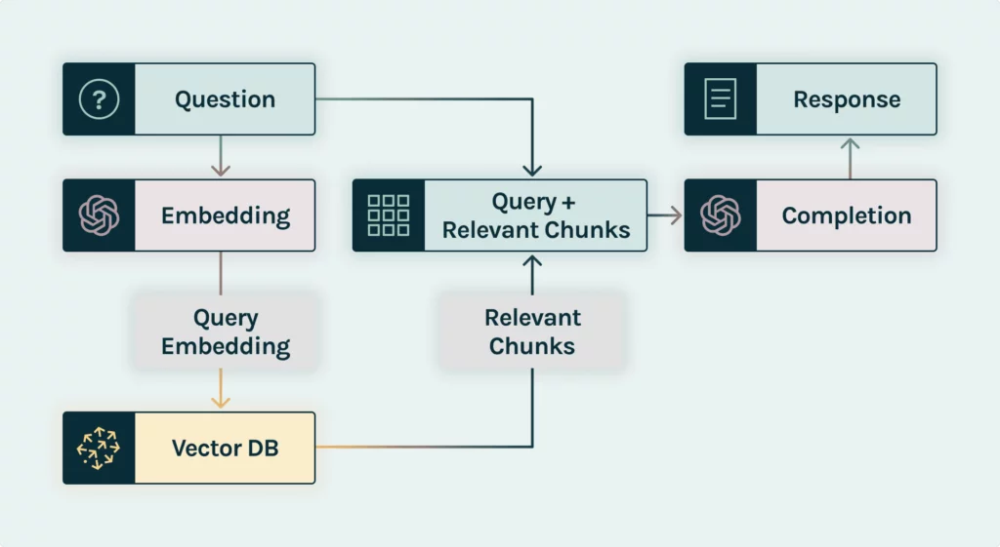
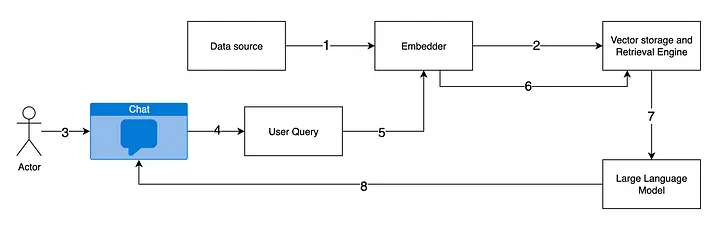

# RAG

## 용어 비유(정리)
- 임베딩 : 파일링 시스템 코드
- 벡터 DB : 파일링 캐비닛
- 프리 프로세싱 : 방송 나가기 전에 미리미리 자료 다 정리해둠
- 포스트 프로세싱 : 유튜버/아나운서가 녹화해둔 답변을 편집집

## RAG 시스템 타입
### 아키텍처 타입
- 기본 : 질문이 들어옴 &rarr; 답변을 열심히 찾아서 정리해옴 &rarr; 아나운서에게 이거 보고 답변하라고 함.
  - "답변에 필요한 정보를 열심히 찾아서"
  - "정리해서"
    - 물어볼만한 답변을 미리 폴더에 잘 정리해두기
    - 사연도 정리해두기
    - 유튜브 댓글도 리서치해서 잘 정리해두기
    - 다시 한 번 추출해서 정리하기

### RAG 시스템 구성 샘플

